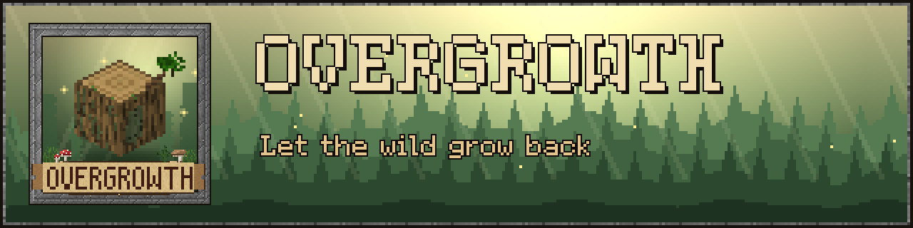
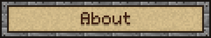
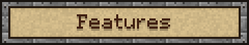
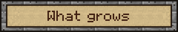
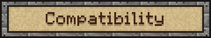
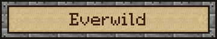
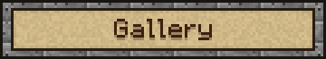
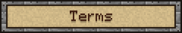

  

  <b>Spice your world with natural details.</b> 
  <i>Crafted by Hardek</i>

  
  
  

  <a href="https://modrinth.com/resourcepack/overgrowth"><b>Modrinth</b></a> ·
  <a href="https://www.curseforge.com/minecraft/texture-packs/overgrowth"><b>CurseForge</b></a> ·
  <a href="../../releases"><b>Download</b></a>

Overgrowth lets nature take back the world, one block at a time.
Moss creeps up old trunks, twigs push out of the bark, bricks come loose from forgotten walls,
and the ground blends softly from one block to the next, all on top of the vanilla textures.

- **Vanilla at heart** : every detail is built on the vanilla textures, so it fits right in.
- **Never the same twice** : details appear at random, in many shapes, and turn in every direction.
- **Natural blending** : dirt, sand, gravel, snow, moss and stone spill softly onto the adjacent blocks.
- **Bushy leaves** : leaves spill out of their block for fuller, softer trees.
- **Lightweight** : simple models, build in mind for performance.

| | |
|---|---|
| 🌳 **Trees** | moss and lichen on the bark, twigs with leafy tufts, bare dead twigs, shelf fungus, resin, bird nests |
| 🍎 **Leaves** | bushy leaves, apples, acorns, pinecones, cherries, catkins, cocoa, acacia pods, blossoms |
| 💧 **Water** | thick cattails, flowering lily pads, algae, icicles |
| 🪨 **Ground & caves** | roots, pebbles, shells, pale mushrooms |
| 🍄 **Mushrooms** | tiny mushrooms sprouting on caps, bracket fungi on mushroom stems |
| 🏰 **Builds** | loose bricks sticking out of stone walls, moss on stone and planks, wrought-iron sconces, sacks on barrels, straw on hay |

| Version | Forge / NeoForge | Fabric / Vanilla |
|---|:---:|:---:|
| 1.13 and older | ❌ | ❌ |
| 1.14 – 1.18 | 🟧 | 🟧 |
| 1.19 – 1.19.4 | ✅ ² | ✅ ² |
| 1.20 – 1.20.1 | ✅ | ✅ |
| 1.20.2 – 1.21.11 | ✅ | ✅ ¹ |
| 26.1 – 26.3 | ✅ | ✅ |

✅ Supported.

🟧 Partial: newer blocks and some details may be missing.

❌ Not supported.

¹ A few see-through details on solid blocks aren't shown on these versions.

² Minecraft shows a harmless "made for a newer version" warning, just enable the pack anyway.

**Blending** between blocks needs [Continuity](https://modrinth.com/mod/continuity) (or OptiFine). Everything else works without any mod.

**With other packs:** put Overgrowth above your texture pack. Base blocks use the vanilla texture names, so most texture packs still show through.

**Installation:** drop the `.zip` into your `resourcepacks` folder and enable it in *Options → Resource Packs*.

Overgrowth is also built into [**Everwild**](https://github.com/Hardekk/Everwild), a MedieVanilla resource pack.
If you play with Everwild, you don't need this pack: everything is already included.

<!-- Gallery: add screenshots to images/ and uncomment

-->

- ✅ Play with it, share it, make videos and screenshots with it.
- ✅ Use it in modpacks, simply just link back to the official page please! 
- ❌ Don't reupload the pack or its textures elsewhere.
- ❌ Don't claim the textures as your own.

See [LICENSE.md](LICENSE.md) for details.

© 2026 Hardek. This is NOT an official Minecraft product. Not approved by or associated with Mojang or Microsoft.

